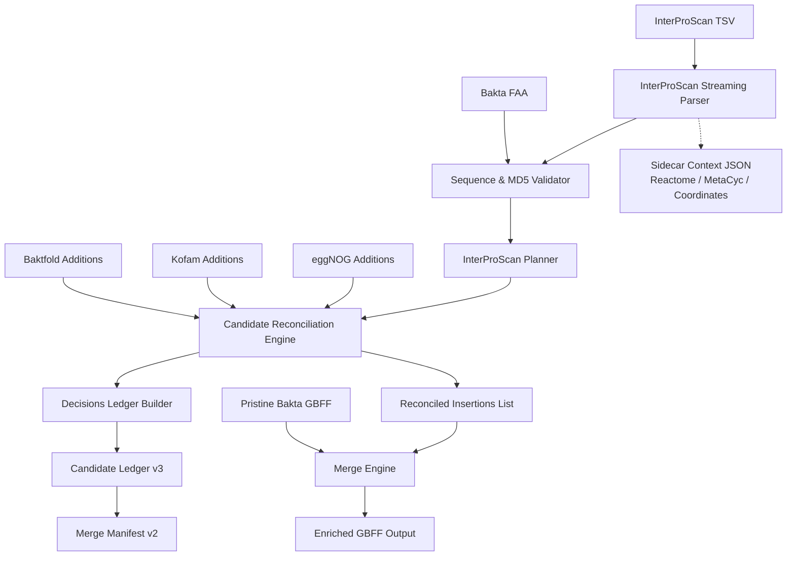

# Audited Implementation Plan: InterProScan Annotation Enrichment

## Audit Verdict & Executive Summary

The published `InterProScan-datasets` across `BK71A`, `C14`, and `SM` provide rich domain architecture, protein family classification, and functional ontology evidence (InterPro entries, GO terms, Pfam, TIGRFAM, CDD, etc.). However, integrating InterProScan evidence into the byte-preserving Bakta enrichment pipeline requires strict architectural guardrails to prevent data explosion, maintain GenBank specification compliance, and preserve byte-exact provenance.

This plan resolves the following findings identified during the review of the real InterProScan dataset files (`.tsv`, `.gff3`, `.json`):

1. **Pathway Qualifier Explosion Guardrail**: Column 14 in the InterProScan TSV files contains extensive cross-references to external pathway databases, predominantly eukaryotic pathways from Reactome (over 4.5 million occurrences per sample, mapping human, mouse, rat, and fly pathways) and MetaCyc (over 2.4 million occurrences). Directly emitting these as GenBank qualifiers (`/db_xref` or `/note`) would bloat the `.gbff` files by hundreds of megabytes with biologically inappropriate eukaryotic pathway assertions on bacterial genomes. Pathway annotations must **never** be promoted to feature qualifiers; they must be captured exclusively in sidecar context manifests (`--context-report`).
2. **Streaming TSV vs. Massive JSON Parsing**: While the `.json` exports (823 MB to 997 MB per sample) contain rich release version metadata, loading them with `json.load()` requires 4–6 GB of memory and causes significant latency. The `.tsv` files (131 MB to 157 MB) contain all primary mapping evidence (query accession, sequence MD5, member database, signature, coordinates, scores, InterPro accession, and GO terms) and can be streamed line-by-line with negligible memory footprint. The implementation must adopt **streaming TSV parsing** as the default production engine, with `--interproscan-version` supplied via CLI or inferred from peer manifest/JSON metadata.
3. **Sequence Integrity & Translation Concordance**: InterProScan TSV exports record the 32-character MD5 digest of each query protein in Column 1. Verification against the Bakta FAA and GBFF files confirms:
   - **C14**: 4,457 query proteins; 0 locus tag mismatches; 0 sequence MD5 mismatches against `C14-NMZ.faa`.
   - **SM**: 4,381 query proteins; 0 locus tag mismatches; 0 sequence MD5 mismatches against `SM-NMZ.faa`.
   - **BK71A**: 3,834 query proteins; 0 locus tag mismatches against `BK71A-restored.gbff`; 0 MD5 mismatches against the restored CDS `/translation` strings.
   The parser must strictly enforce sequence MD5 parity between the InterProScan evidence, the supplied FAA, and the target GBFF CDS `/translation`.
4. **BK71A Provenance Boundary**: BK71A does not possess a pristine Bakta FAA in this repository. Its InterProScan results match the restored translation bytes in `BK71A-restored.gbff` perfectly, but under repository data policy (`docs/data/PUBLISHING.md`), BK71A artifacts remain `historical_unverified`. The pipeline must require explicit acknowledgment (`--allow-unverified-lineage` or `--translation-evidence-manifest`) when enriching BK71A.
5. **Qualifier Normalization & INSDC Standards**:
   - InterPro accession (`IPRxxxxxx`): standard INSDC `/db_xref="InterPro:IPRxxxxxx"`.
   - Gene Ontology (`GO:ddddddd`): standard INSDC `/db_xref="GO:ddddddd"`.
   - Member Database Signatures: Bakta natively emits Pfam as `/note="PFAM:PFxxxxx.yy"`. InterProScan outputs unversioned base accessions (`PFxxxxx`). The pipeline must support syntactic parity via `/note="PFAM:PFxxxxx"`, while detecting base-accession overlap against existing versioned Bakta notes to prevent duplicate qualification.
6. **Multi-Source Shared Support**: InterProScan contributes 5,549 novel GO terms in C14 and 5,475 in SM. Crucially, 3,858 GO terms in C14 overlap with Bakta's existing qualifiers, and 4,528 overlap with eggNOG annotations. The merge engine and candidate ledger (`schemas/merge-manifest.v2.schema.json`) must record these as `shared_support` or `supported_existing`, linking provenance across all supporting evidence sources without duplicate line emissions.

---

## Dataset Review & Scientific Baselines

### Materialized File Inventory

The evidence files are published in Git LFS under `data/<sample>/evidence/interproscan/` and referenced by the root drop directories `InterProScan-datasets/<sample>/`:

| Sample | Input Role | Format | Path | Size (Bytes) | SHA-256 |
|---|---|---|---|---:|---|
| **BK71A** | Evidence | TSV | `data/BK71A/evidence/interproscan/BK71A.interproscan.tsv` | 131,729,054 | `0b44aab2a511ebec53f1fd78ae004674ad060c3acb44a2a31864bdbfd974aa21` |
| **BK71A** | Evidence | GFF3 | `data/BK71A/evidence/interproscan/BK71A.interproscan.gff3` | 147,670,717 | `a827963602a2143747b7313b300c850fcaf1bfc967de09564a95afb9953e859a` |
| **BK71A** | Evidence | JSON | `data/BK71A/evidence/interproscan/BK71A.interproscan.json` | 823,138,682 | `7b6805fc2b00def04c2ddced9471bf6ed16ea34683d426adc06bc55bb3b9282c` |
| **C14** | Evidence | TSV | `data/C14/evidence/interproscan/C14-NMZ.interproscan.tsv` | 157,031,166 | `5de249ac97ed468bdae75c5ab483d91f5d2f613e7dbbc2e922ee263ec441ac6b` |
| **C14** | Evidence | GFF3 | `data/C14/evidence/interproscan/C14-NMZ.interproscan.gff3` | 176,427,419 | `8c3fc56a24c208a8fd3cb720f30e8c5d8e2533b0419806935e6f20a51a773a56` |
| **C14** | Evidence | JSON | `data/C14/evidence/interproscan/C14-NMZ.interproscan.json` | 997,020,038 | `cc992aa4a648490610ea83d7276ea054031f91270485220f8dfef38ca4891d69` |
| **SM** | Evidence | TSV | `data/SM/evidence/interproscan/SM-NMZ.interproscan.tsv` | 153,607,485 | `3cb5f0e8b6723faae26f450c4cc288526452cd8e9483e7aa0920029f2d3f29fe` |
| **SM** | Evidence | GFF3 | `data/SM/evidence/interproscan/SM-NMZ.interproscan.gff3` | 172,655,728 | `9cfb5bc785c48f14bcb38e748e79b37c66c5107af07efacd19775471cd6b7f67` |
| **SM** | Evidence | JSON | `data/SM/evidence/interproscan/SM-NMZ.interproscan.json` | 976,373,653 | `6df5770d87204131b42b24f8bb9f0726e9662518e21a78da4b75e5edb8cf2bd2` |

Producer version recorded in `docs/data/MANIFEST.json`: `InterProScan 5.59-91.0`.

### Exact Dataset Characterization & Baseline Metrics

The following metrics reflect the audited content of the materialized TSV files against the pristine Bakta GBFF records:

| Metric | BK71A | C14 | SM |
|---|---:|---:|---:|
| **Total Bakta CDS Features** | 4,131 | 4,636 | 4,576 |
| **InterProScan Total Hit Lines** | 32,791 | 40,234 | 39,684 |
| **Unique Query CDSs in InterProScan** | 3,834 | 4,457 | 4,381 |
| **Bakta CDSs without InterProScan Hit** | 297 | 179 | 195 |
| **Query Locus Tag Mismatches with GBFF** | **0** | **0** | **0** |
| **Sequence MD5 Mismatches with FAA / GBFF** | **0** | **0** | **0** |
| **Integrated Hits (assigned to InterPro Entry)** | 22,360 | 27,420 | 27,044 |
| **Unintegrated Hits (`-` InterPro Entry)** | 10,431 | 12,814 | 12,640 |
| **Unique CDS–InterPro Accession Pairs** | 12,994 | 16,160 | 15,930 |
| **Unique InterPro Accessions (IPR IDs)** | 5,415 | 6,282 | 6,254 |
| **Pristine Bakta InterPro Entries** | 0 | 0 | 0 |
| **Novel CDS–InterPro Pairs to Add** | **12,994** | **16,160** | **15,930** |
| **Total CDS–GO Pairs in InterProScan** | 6,880 | 9,407 | 9,332 |
| **Unique GO Term Identifiers** | 1,354 | 1,725 | 1,731 |
| **GO Pairs Overlapping Pristine Bakta** | 3,680 | 3,858 | 3,857 |
| **Novel CDS–GO Pairs to Add** | **3,200** | **5,549** | **5,475** |
| **Total CDS–Pfam Signature Pairs** | 5,131 | 6,219 | 6,088 |
| **Pfam Overlap with Pristine Bakta Notes** | 9 | 5 | 15 |
| **Novel CDS–Pfam Pairs** | **5,122** | **6,214** | **6,073** |
| **Total CDS–TIGRFAM Signature Pairs** | 1,454 | 1,766 | 1,758 |
| **Total CDS–CDD Signature Pairs** | 2,183 | 2,591 | 2,571 |
| **Reactome Pathway Cross-References (Col 14)** | 3,717,389 | 4,534,168 | 4,416,062 |
| **MetaCyc Pathway Cross-References (Col 14)** | 2,177,198 | 2,441,941 | 2,410,944 |

### Member Database Hit Distribution

InterProScan combines multiple member database analyses. In C14 (40,234 total hits), the analysis breakdown is:
- `Pfam`: 6,479 hits (6,258 integrated into InterPro, 221 unintegrated)
- `Gene3D`: 6,463 hits (3,649 integrated, 2,814 unintegrated)
- `SUPERFAMILY`: 5,131 hits (4,159 integrated, 972 unintegrated)
- `PANTHER`: 3,760 hits (1,226 integrated, 2,534 unintegrated)
- `PRINTS`: 3,581 hits (3,007 integrated, 574 unintegrated)
- `FunFam`: 2,791 hits (0 integrated, 2,791 unintegrated)
- `CDD`: 2,637 hits (1,126 integrated, 1,511 unintegrated)
- `ProSiteProfiles`: 1,964 hits (1,782 integrated, 182 unintegrated)
- `TIGRFAM`: 1,787 hits (1,766 integrated, 21 unintegrated)
- `ProSitePatterns`: 1,367 hits (1,340 integrated, 27 unintegrated)
- `SMART`: 1,292 hits (1,243 integrated, 49 unintegrated)
- `Hamap`: 1,062 hits (1,062 integrated, 0 unintegrated)
- `PIRSF`: 791 hits (745 integrated, 46 unintegrated)
- `Coils`: 501 hits (0 integrated, 501 unintegrated)
- `MobiDBLite`: 486 hits (0 integrated, 486 unintegrated)
- `SFLD`: 141 hits (57 integrated, 84 unintegrated)
- `AntiFam`: 1 hit (0 integrated, 1 unintegrated)

---

## Required Invariants & Policy

1. **Pristine Bakta Byte Preservation**: The pristine Bakta GBFF remains the authoritative base. Splicing into byte offsets must retain original sequence, header, and indentation formatting. Only allowlisted insertions may differ.
2. **Deterministic Sequence Identity Validation**:
   - Every InterProScan row query ID must exist uniquely as a CDS `locus_tag` in the base GBFF.
   - When an FAA is provided, the query ID must exist in the FAA, and the TSV sequence MD5 (Column 1) must equal the MD5 of the uppercase FAA sequence.
   - The FAA sequence must match the GBFF CDS `/translation`.
   - Unknown queries or MD5 hash mismatches are fatal.
3. **Non-Destructive Qualifier Merging**:
   - Existing Bakta qualifiers (`/gene`, `/product`, `/protein_id`, `/translation`, `/note`, `/db_xref`, `/EC_number`) are never replaced or removed.
   - Existing `/db_xref="GO:..."` qualifiers are retained; novel GO terms are appended.
   - Novel InterPro entries are appended as `/db_xref="InterPro:IPRxxxxxx"`.
   - If Bakta already has `/note="PFAM:PF00005.33"`, a candidate for `PF00005` is recognized as `supported_existing` and not re-emitted.
4. **Idempotency**: Running the enrichment twice with the same InterProScan input must produce byte-identical output with zero secondary insertions.
5. **No Biological Pathway Pollution**: Reactome and MetaCyc pathway strings must not be written to GenBank feature qualifiers. They are routed exclusively to the JSON sidecar report.
6. **Feature Provenance & Structured Inference**:
   - For every CDS receiving at least one InterProScan qualifier, add one structured inference:
     `/inference="protein motif:InterProScan:5.59-91.0"`
   - Append one source COMMENT marker per record:
     `##enrich-bakta:InterProScan:v1##` with software version, date, and provenance caveat.
7. **Candidate Ledger Compliance**:
   - All candidate proposals, emitted qualifiers, and suppressed/shared entries must conform to `schemas/merge-manifest.v2.schema.json`.
   - Source ID: `InterProScan`.
   - Evidence classes: `interpro_entry`, `go_term`, `member_db_signature`, `pathway_context`.

---

## Architectural Design

### Module Structure

```text
src/enrich_bakta_lib/
├── core/
│   ├── merge_engine.py      # Core byte-splicing and verification primitives
│   └── decisions.py         # CandidateDecision, source resolution, and ledger reconciliation
├── sources/
│   ├── interproscan.py      # NEW: Streaming TSV parser, sequence validator, and addition planner
│   ├── value_rules.py       # Updated: Affirmative token validators for IPR, PF, TIGR, CDD
│   ├── baktfold.py          # Baktfold structural annotations
│   ├── eggnog.py            # eggNOG-mapper functional annotations
│   └── kofam.py             # KofamScan KEGG annotations
└── workflows/
    └── enrich.py            # Updated: Unified 4-way merge orchestration CLI
merge_interproscan_bakta.py   # NEW: Standalone InterProScan enrichment CLI
```

### Data Flow & Multi-Source Reconciliation



---

## Implementation Phases

### Phase 0: Hygiene, Test Fixtures & Regression Baseline

1. Verify existing test suite and linting passes:
   ```powershell
   $env:PYTHONPATH="."
   python -m pytest -q --basetemp=".test-output/tmp" -o cache_dir=".test-output/cache"
   ruff check src tests tools
   python -m mypy src
   ```
2. Build minimal synthetic InterProScan test fixtures in `tests/test_interproscan_enrichment.py`:
   - Valid TSV with integrated and unintegrated hits.
   - Hits with GO terms and multi-species Reactome pathways.
   - TSV with sequence MD5 matching synthetic FASTA.
   - Negative fixtures: invalid MD5, corrupt column count, unknown locus tags, invalid IPR accession grammar.

### Phase 1: Value Rules & Affirmative Grammars

Update `src/enrich_bakta_lib/sources/value_rules.py`:
- Add `INTERPRO_RE = re.compile(r"IPR\d{6}\Z")`
- Add `PFAM_RE = re.compile(r"PF\d{5}\Z")`
- Add `TIGRFAM_RE = re.compile(r"TIGR\d{5}\Z")`
- Add `CDD_RE = re.compile(r"(?:cd|cl|sd|ch)\d{5}\Z")`
- Provide `validate_interpro_entry(val)` and `validate_member_db_signature(db, val)` functions.

### Phase 2: InterProScan Source Model & Streaming Parser

Create `src/enrich_bakta_lib/sources/interproscan.py`:
- Immutable `InterProScanHit` dataclass.
- Streaming generator `iter_interproscan_tsv(handle)` to process 150MB+ TSV files row-by-row without buffering entire tables in RAM.
- MD5 validation against FAA and GBFF translations.
- `plan_interproscan_additions(base, hits, ...)`:
  - Generates `/db_xref="InterPro:IPRxxxxxx"` insertions.
  - Generates `/db_xref="GO:ddddddd"` insertions.
  - Generates member DB note/xref insertions based on policy.
  - Generates `/inference="protein motif:InterProScan:<version>"` insertions.
  - Produces candidate decisions for the ledger.

### Phase 3: Candidate Ledger & Reconciliation Integration

Update `src/enrich_bakta_lib/core/decisions.py`:
- Expand `_source_id` to recognize `interproscan` and `interpro`.
- Support evidence classes: `interpro_entry`, `go_term`, `member_db_signature`, `pathway_context`.
- Update GO term reconciliation:
  - When eggNOG and InterProScan propose the identical `GO:ddddddd`, emit only **one** insertion.
  - Mark both candidates as `shared_support` and record cross-references in `supporting_candidate_ids`.
- Handle Pfam note reconciliation against existing Bakta `/note="PFAM:PFxxxxx.yy"`.

### Phase 4: Standalone & Unified Workflow CLI

1. Create `merge_interproscan_bakta.py` standalone script.
2. Update `src/enrich_bakta_lib/workflows/enrich.py`:
   - Add CLI arguments:
     - `--interproscan PATH`
     - `--interproscan-version VERSION` (default: auto-detect or "5.59-91.0")
     - `--interproscan-member-dbs LIST` (default: "Pfam,TIGRFAM")
     - `--interproscan-pfam-as-xref` (boolean flag, default False)
     - `--interproscan-context-report PATH`
   - Incorporate InterProScan into `enrich()` execution chain.

### Phase 5: Verification, Benchmarking & Acceptance Gate

1. Verify synthetic unit and regression test suite.
2. Execute real data enrichment on C14 and SM using the published evidence files.
3. Validate output GenBank syntax with Biopython `SeqIO.parse`.
4. Validate generated manifest against `schemas/merge-manifest.v2.schema.json`.
5. Verify raw byte idempotency (re-running on enriched output produces identical byte content).

---

## Pseudocode Diffs

### 1. Value Rules Extension (`src/enrich_bakta_lib/sources/value_rules.py`)

```diff
--- a/src/enrich_bakta_lib/sources/value_rules.py
+++ b/src/enrich_bakta_lib/sources/value_rules.py
@@ -10,6 +10,10 @@
 EC_FULL_RE = re.compile(r"\d+\.\d+\.\d+\.\d+\Z")
 EC_PARTIAL_RE = re.compile(r"(?:\d+\.\d+\.\d+\.-|\d+\.\d+\.-\.-|\d+\.-\.-\.-)\Z")
+INTERPRO_RE = re.compile(r"IPR\d{6}\Z")
+PFAM_RE = re.compile(r"PF\d{5}\Z")
+TIGRFAM_RE = re.compile(r"TIGR\d{5}\Z")
+CDD_RE = re.compile(r"(?:cd|cl|sd|ch)\d{5}\Z")
 STRUCTURED_TOKEN_RE = re.compile(
-    r"(?:GO:\d{7}|KEGG:K\d{5}|CAZy:(?:GH|GT|PL|CE|AA|CBM)\d+(?:_\d+)?)\Z"
+    r"(?:GO:\d{7}|KEGG:K\d{5}|CAZy:(?:GH|GT|PL|CE|AA|CBM)\d+(?:_\d+)?|InterPro:IPR\d{6}|PFAM:PF\d{5}(?:\.\d+)?|TIGRFAM:TIGR\d{5})\Z"
 )
@@ -78,6 +82,31 @@
     return ValueValidationResult(
         value,
         f"{prefix}:{normalized_identifier}",
         "valid",
         "supported structural xref",
     )
+
+def validate_interpro_accession(value: str) -> ValueValidationResult:
+    raw = value.strip()
+    if not raw:
+        return ValueValidationResult(value, None, "missing", "InterPro accession is empty")
+    if raw.startswith("InterPro:"):
+        raw = raw[9:]
+    if INTERPRO_RE.fullmatch(raw):
+        return ValueValidationResult(value, f"InterPro:{raw}", "valid", "valid InterPro accession")
+    return ValueValidationResult(value, None, "invalid", f"invalid InterPro accession {value!r}")
+
+def validate_pfam_accession(value: str) -> ValueValidationResult:
+    raw = value.strip()
+    if not raw:
+        return ValueValidationResult(value, None, "missing", "Pfam accession is empty")
+    if raw.startswith("PFAM:") or raw.startswith("Pfam:"):
+        raw = raw[5:]
+    # Strip optional version suffix for base normalization
+    base_match = re.match(r"^(PF\d{5})(?:\.\d+)?$", raw)
+    if base_match:
+        return ValueValidationResult(value, base_match.group(1), "valid", "valid Pfam accession")
+    return ValueValidationResult(value, None, "invalid", f"invalid Pfam accession {value!r}")
```

### 2. InterProScan Source Engine (`src/enrich_bakta_lib/sources/interproscan.py`)

```python
"""InterProScan evidence parser, validator, and addition planner."""

from __future__ import annotations

import hashlib
import io
import re
from collections.abc import Iterable, Iterator, Mapping
from dataclasses import dataclass, field
from pathlib import Path
from typing import Any

from enrich_bakta_lib.core.decisions import CandidateDecision, stable_id
from enrich_bakta_lib.core.merge_engine import (
    Insertion,
    MergeError,
    RawDocument,
    RawFeature,
    cds_by_locus,
    comment_insertion,
    feature_uid,
    format_qualifier,
    insertion_uid,
    qualifier_insertion,
    sha256_bytes,
)
from enrich_bakta_lib.sources.value_rules import (
    validate_interpro_accession,
    validate_pfam_accession,
)

COMMENT_MARKER = "##enrich-bakta:InterProScan:v1##"
GO_RE = re.compile(r"GO:\d{7}\Z")


@dataclass(frozen=True)
class InterProScanHit:
    row_number: int
    query_id: str
    md5: str
    length: int
    analysis: str
    signature_accession: str
    signature_description: str
    start: int
    stop: int
    score: str
    status: str
    date: str
    interpro_accession: str | None
    interpro_description: str | None
    go_terms: tuple[str, ...]
    pathways: tuple[str, ...]


def iter_interproscan_tsv(
    stream: Iterable[str],
) -> Iterator[InterProScanHit]:
    """Stream InterProScan TSV rows with validation."""
    for row_number, raw_line in enumerate(stream, start=1):
        line = raw_line.rstrip("\r\n")
        if not line or line.startswith("#"):
            continue
        parts = line.split("\t")
        if len(parts) < 11:
            raise MergeError(
                f"InterProScan TSV row {row_number}: expected >=11 columns, got {len(parts)}"
            )

        query_id = parts[0].strip()
        md5 = parts[1].strip()
        length = int(parts[2].strip())
        analysis = parts[3].strip()
        sig_acc = parts[4].strip()
        sig_desc = parts[5].strip()
        start = int(parts[6].strip())
        stop = int(parts[7].strip())
        score = parts[8].strip()
        status = parts[9].strip()
        date = parts[10].strip()

        ipr_acc = (
            parts[11].strip()
            if len(parts) > 11 and parts[11].strip() != "-"
            else None
        )
        ipr_desc = (
            parts[12].strip()
            if len(parts) > 12 and parts[12].strip() != "-"
            else None
        )

        go_terms: tuple[str, ...] = ()
        if len(parts) > 13 and parts[13].strip() != "-":
            raw_gos = [g.strip() for g in parts[13].split("|") if g.strip()]
            go_terms = tuple(dict.fromkeys(g for g in raw_gos if GO_RE.match(g)))

        pathways: tuple[str, ...] = ()
        if len(parts) > 14 and parts[14].strip() != "-":
            pathways = tuple(
                p.strip() for p in parts[14].split("|") if p.strip()
            )

        yield InterProScanHit(
            row_number=row_number,
            query_id=query_id,
            md5=md5,
            length=length,
            analysis=analysis,
            signature_accession=sig_acc,
            signature_description=sig_desc,
            start=start,
            stop=stop,
            score=score,
            status=status,
            date=date,
            interpro_accession=ipr_acc,
            interpro_description=ipr_desc,
            go_terms=go_terms,
            pathways=pathways,
        )


def plan_interproscan_additions(
    base: RawDocument,
    hits: Iterable[InterProScanHit],
    *,
    source_sha256: str,
    interproscan_version: str = "5.59-91.0",
    member_dbs: tuple[str, ...] = ("Pfam", "TIGRFAM"),
    pfam_as_xref: bool = False,
    faa_proteins: Mapping[str, str] | None = None,
    add_comment_note: bool = True,
    add_feature_provenance: bool = True,
) -> tuple[list[Insertion], list[CandidateDecision], dict[str, Any]]:
    """Plan additions, candidates, and manifest entries from InterProScan evidence."""
    cds_map = cds_by_locus(base)
    insertions: list[Insertion] = []
    candidates: list[CandidateDecision] = []

    # Group hits by CDS query
    hits_by_query: dict[str, list[InterProScanHit]] = {}
    for hit in hits:
        hits_by_query.setdefault(hit.query_id, []).append(hit)

    # Validate protein existence and MD5 checksum parity
    for query_id, qhits in hits_by_query.items():
        if query_id not in cds_map:
            raise MergeError(f"InterProScan query {query_id!r} not found in base GBFF CDSs")

        expected_md5 = qhits[0].md5
        if faa_proteins is not None:
            if query_id not in faa_proteins:
                raise MergeError(f"InterProScan query {query_id!r} not found in FAA proteins")
            faa_seq = faa_proteins[query_id]
            calc_md5 = hashlib.md5(faa_seq.encode("utf-8")).hexdigest()
            if calc_md5 != expected_md5:
                raise MergeError(
                    f"InterProScan MD5 {expected_md5} mismatch for {query_id} (FAA MD5: {calc_md5})"
                )

    records_with_additions: set[int] = set()

    for query_id, qhits in sorted(hits_by_query.items()):
        feature = cds_map[query_id]
        feat_uid = feature_uid(feature)
        existing_xrefs = set(feature.values("db_xref"))
        existing_notes = set(feature.values("note"))

        # 1. Plan InterPro entries (/db_xref="InterPro:IPRxxxxxx")
        unique_iprs = sorted(
            dict.fromkeys(
                h.interpro_accession for h in qhits if h.interpro_accession
            )
        )
        for ipr in unique_iprs:
            xref_val = f"InterPro:{ipr}"
            cand_id = stable_id(
                "candidate",
                {"source": "InterProScan", "query": query_id, "field": "db_xref", "val": xref_val},
            )
            if xref_val in existing_xrefs:
                candidates.append(
                    CandidateDecision(
                        candidate_id=cand_id,
                        source_id="InterProScan",
                        source_sha256=source_sha256,
                        target_feature_uids=(feat_uid,),
                        field="db_xref",
                        qualifier="db_xref",
                        raw_value=ipr,
                        normalized_value=xref_val,
                        planned_status="supported_existing",
                        candidate_role="substantive_evidence",
                        evidence_class="interpro_entry",
                        reason_code="existing-qualifier-match",
                        final_status="supported_existing",
                        reason=f"CDS already contains {xref_val}",
                    )
                )
            else:
                ins = qualifier_insertion(
                    feature.record_index,
                    feat_uid,
                    "db_xref",
                    xref_val,
                    source_id="InterProScan",
                    evidence_class="interpro_entry",
                )
                insertions.append(ins)
                records_with_additions.add(feature.record_index)
                candidates.append(
                    CandidateDecision(
                        candidate_id=cand_id,
                        source_id="InterProScan",
                        source_sha256=source_sha256,
                        target_feature_uids=(feat_uid,),
                        field="db_xref",
                        qualifier="db_xref",
                        raw_value=ipr,
                        normalized_value=xref_val,
                        planned_status="planned_insertion",
                        candidate_role="substantive_evidence",
                        evidence_class="interpro_entry",
                        reason_code="novel-interpro-entry",
                        insertion_ids=(insertion_uid(ins),),
                        reason="Novel InterPro accession",
                    )
                )

        # 2. Plan GO terms (/db_xref="GO:ddddddd")
        all_gos = sorted(dict.fromkeys(g for h in qhits for g in h.go_terms))
        for go in all_gos:
            cand_id = stable_id(
                "candidate",
                {"source": "InterProScan", "query": query_id, "field": "db_xref", "val": go},
            )
            if go in existing_xrefs:
                candidates.append(
                    CandidateDecision(
                        candidate_id=cand_id,
                        source_id="InterProScan",
                        source_sha256=source_sha256,
                        target_feature_uids=(feat_uid,),
                        field="db_xref",
                        qualifier="db_xref",
                        raw_value=go,
                        normalized_value=go,
                        planned_status="supported_existing",
                        candidate_role="substantive_evidence",
                        evidence_class="go_term",
                        reason_code="existing-qualifier-match",
                        final_status="supported_existing",
                        reason=f"CDS already contains {go}",
                    )
                )
            else:
                ins = qualifier_insertion(
                    feature.record_index,
                    feat_uid,
                    "db_xref",
                    go,
                    source_id="InterProScan",
                    evidence_class="go_term",
                )
                insertions.append(ins)
                records_with_additions.add(feature.record_index)
                candidates.append(
                    CandidateDecision(
                        candidate_id=cand_id,
                        source_id="InterProScan",
                        source_sha256=source_sha256,
                        target_feature_uids=(feat_uid,),
                        field="db_xref",
                        qualifier="db_xref",
                        raw_value=go,
                        normalized_value=go,
                        planned_status="planned_insertion",
                        candidate_role="substantive_evidence",
                        evidence_class="go_term",
                        reason_code="novel-go-term",
                        insertion_ids=(insertion_uid(ins),),
                        reason="Novel GO term from InterProScan",
                    )
                )

        # 3. Plan Member Database Signatures (Pfam, etc.)
        for db in member_dbs:
            sigs = sorted(
                dict.fromkeys(h.signature_accession for h in qhits if h.analysis == db)
            )
            for sig in sigs:
                if db == "Pfam":
                    note_val = f"PFAM:{sig}"
                    # Check base overlap with existing notes like PFAM:PF00005.33
                    has_existing = any(
                        n.startswith(f"PFAM:{sig}") or n.startswith(f"Pfam:{sig}")
                        for n in existing_notes
                    )
                    cand_id = stable_id(
                        "candidate",
                        {"source": "InterProScan", "query": query_id, "field": "note", "val": note_val},
                    )
                    if has_existing:
                        candidates.append(
                            CandidateDecision(
                                candidate_id=cand_id,
                                source_id="InterProScan",
                                source_sha256=source_sha256,
                                target_feature_uids=(feat_uid,),
                                field="note",
                                qualifier="note",
                                raw_value=sig,
                                normalized_value=note_val,
                                planned_status="supported_existing",
                                candidate_role="substantive_evidence",
                                evidence_class="member_db_signature",
                                reason_code="existing-pfam-match",
                                final_status="supported_existing",
                                reason=f"CDS already carries matching Pfam family {sig}",
                            )
                        )
                    else:
                        qual_type = "db_xref" if pfam_as_xref else "note"
                        norm_val = f"Pfam:{sig}" if pfam_as_xref else note_val
                        ins = qualifier_insertion(
                            feature.record_index,
                            feat_uid,
                            qual_type,
                            norm_val,
                            source_id="InterProScan",
                            evidence_class="member_db_signature",
                        )
                        insertions.append(ins)
                        records_with_additions.add(feature.record_index)
                        candidates.append(
                            CandidateDecision(
                                candidate_id=cand_id,
                                source_id="InterProScan",
                                source_sha256=source_sha256,
                                target_feature_uids=(feat_uid,),
                                field=qual_type,
                                qualifier=qual_type,
                                raw_value=sig,
                                normalized_value=norm_val,
                                planned_status="planned_insertion",
                                candidate_role="substantive_evidence",
                                evidence_class="member_db_signature",
                                reason_code="novel-pfam-signature",
                                insertion_ids=(insertion_uid(ins),),
                                reason="Novel Pfam signature hit",
                            )
                        )

        # 4. Feature Provenance Inference
        if add_feature_provenance and (unique_iprs or all_gos):
            inf_val = f"protein motif:InterProScan:{interproscan_version}"
            if inf_val not in feature.values("inference"):
                ins = qualifier_insertion(
                    feature.record_index,
                    feat_uid,
                    "inference",
                    inf_val,
                    source_id="InterProScan",
                    evidence_class="producer_provenance",
                )
                insertions.append(ins)

    # 5. Record COMMENT Note
    if add_comment_note and records_with_additions:
        for rec_idx in sorted(records_with_additions):
            comment_text = (
                f"{COMMENT_MARKER} InterProScan annotation evidence added by enrich-bakta. "
                f"Producer: InterProScan v{interproscan_version}. "
                "Evidence reflects in silico domain/family predictions, not laboratory-verified phenotype."
            )
            insertions.append(
                comment_insertion(
                    rec_idx,
                    comment_text,
                    source_id="InterProScan",
                )
            )

    stats = {
        "queries_processed": len(hits_by_query),
        "total_insertions": len(insertions),
        "total_candidates": len(candidates),
    }
    return insertions, candidates, stats
```

### 3. Decisions & Candidate Ledger Integration (`src/enrich_bakta_lib/core/decisions.py`)

```diff
--- a/src/enrich_bakta_lib/core/decisions.py
+++ b/src/enrich_bakta_lib/core/decisions.py
@@ -104,6 +104,8 @@
         return "KofamScan"
     if lowered.startswith("eggnog"):
         return "eggNOG"
+    if lowered.startswith("interproscan") or lowered == "interpro":
+        return "InterProScan"
     return value
@@ -530,6 +532,19 @@
+            # Reconcile shared GO term proposals across eggNOG and InterProScan
+            if qualifier == "db_xref" and normalized_value.startswith("GO:"):
+                existing_entry = emitted_by_feature_and_val.get((target_uid, normalized_value))
+                if existing_entry is not None:
+                    # Secondary source providing shared support for already emitted GO term
+                    decision.final_status = "shared_support"
+                    decision.reason_code = "shared-support-go"
+                    decision.supporting_candidate_ids = (existing_entry.candidate_id,)
+                    decision.insertion_ids = existing_entry.insertion_ids
+                    existing_entry.supporting_candidate_ids = tuple(
+                        dict.fromkeys((*existing_entry.supporting_candidate_ids, decision.candidate_id))
+                    )
+                    continue
```

### 4. Workflow Orchestration (`src/enrich_bakta_lib/workflows/enrich.py`)

```diff
--- a/src/enrich_bakta_lib/workflows/enrich.py
+++ b/src/enrich_bakta_lib/workflows/enrich.py
@@ -32,6 +32,7 @@
 from enrich_bakta_lib.sources.baktfold import plan_baktfold_additions
 from enrich_bakta_lib.sources.eggnog import parse_eggnog_path, plan_eggnog_additions
 from enrich_bakta_lib.sources.kofam import parse_kofam_table, plan_kofam_additions
+from enrich_bakta_lib.sources.interproscan import iter_interproscan_tsv, plan_interproscan_additions
@@ -43,6 +44,10 @@
     eggnog_version: str | None = None,
     eggnog_schema: str | None = None,
     min_eggnog_confidence: str = "low",
+    interproscan_path: Path | None = None,
+    interproscan_version: str | None = None,
+    interproscan_member_dbs: str = "Pfam,TIGRFAM",
+    interproscan_context_report: Path | None = None,
     gene_conflict_policy: str = "skip",
     manifest_path: Path | None = None,
@@ -57,7 +62,7 @@
-    if not any((baktfold_path, kofamscan_path, eggnog_path)):
+    if not any((baktfold_path, kofamscan_path, eggnog_path, interproscan_path)):
         raise MergeError("at least one evidence source is required")
-    if (kofamscan_path or eggnog_path) and faa_path is None:
+    if (kofamscan_path or eggnog_path or interproscan_path) and faa_path is None:
-        raise MergeError("--faa is required with --kofamscan or --eggnog")
+        raise MergeError("--faa is required with --kofamscan, --eggnog, or --interproscan")
@@ -140,6 +145,21 @@
+    if interproscan_path:
+        ips_data = read_input_bytes(interproscan_path, "InterProScan")
+        ips_text = ips_data.decode("utf-8")
+        hits = list(iter_interproscan_tsv(ips_text.splitlines()))
+        dbs = tuple(d.strip() for d in interproscan_member_dbs.split(",") if d.strip())
+        planned, ips_candidates, stats = plan_interproscan_additions(
+            base,
+            hits,
+            source_sha256=sha256_bytes(ips_data),
+            interproscan_version=interproscan_version or "5.59-91.0",
+            member_dbs=dbs,
+            faa_proteins=proteins,
+            add_comment_note=add_comment_note,
+            add_feature_provenance=add_feature_provenance,
+        )
+        insertions.extend(planned)
+        candidates.extend(ips_candidates)
+        source_hashes["InterProScan"] = sha256_bytes(ips_data)
```

---

## Validation Handoff for Peer Agents

This validation handoff provides a rigorous, testable specification for subsequent reviewing and testing agents to verify and refine this implementation plan.

### Review Checklist & Invariant Gates

1. **Byte-Level Preservation**:
   - [ ] Confirm that running `finalize_merge()` with InterProScan insertions preserves all original Bakta bytes, comments, and whitespace byte-for-byte outside recorded insertions.
   - [ ] Confirm that re-running the merge on the resulting `.gbff` output yields `0` new insertions (byte-idempotency).
2. **Schema & Manifest Compliance**:
   - [ ] Validate that candidate decisions emit valid `entry_type: "candidate_decision"` matching `schemas/merge-manifest.v2.schema.json`.
   - [ ] Ensure `source_id` is `"InterProScan"`.
   - [ ] Ensure `evidence_class` values belong to `{"interpro_entry", "go_term", "member_db_signature", "producer_provenance"}`.
   - [ ] Ensure `final_status` is one of `{"emitted", "shared_support", "supported_existing"}`.
3. **Multi-Source Reconciled Parity**:
   - [ ] For a joint run (`--baktfold`, `--kofamscan`, `--eggnog`, `--interproscan`), verify that identical GO terms from eggNOG and InterProScan do **not** duplicate `/db_xref="GO:..."` qualifiers in the output.
   - [ ] Verify that `CandidateDecision.supporting_candidate_ids` correctly links the shared candidates in the output manifest.
4. **Boundary Failure Testing**:
   - [ ] Test rejection when a TSV query ID is absent from the base GBFF (must raise `MergeError`).
   - [ ] Test rejection when the TSV sequence MD5 does not match the FAA protein MD5 (must raise `MergeError`).
   - [ ] Test rejection when a corrupt InterPro accession (e.g. `IPR999` with fewer than 6 digits) is encountered.
   - [ ] Test that Reactome and MetaCyc pathways are strictly absent from output feature qualifiers.

### Concrete Execution Commands for Testing Agents

```powershell
# 1. Environment & Pre-Flight Check
$env:PYTHONPATH="."
python -m pytest -q --basetemp=".test-output/tmp" -o cache_dir=".test-output/cache"
ruff check src tests tools
python -m mypy src

# 2. Standalone InterProScan Test Run (C14)
python merge_interproscan_bakta.py `
  data/C14/bakta/C14-NMZ.gbff `
  data/C14/bakta/C14-NMZ.faa `
  data/C14/evidence/interproscan/C14-NMZ.interproscan.tsv `
  .test-output/C14-interpro-enriched.gbff `
  --interproscan-version "5.59-91.0" `
  --manifest .test-output/C14-interpro-enriched.manifest.json

# 3. Schema Validation of Manifest
python -c "
import json, jsonschema
schema = json.load(open('schemas/merge-manifest.v2.schema.json'))
manifest = json.load(open('.test-output/C14-interpro-enriched.manifest.json'))
jsonschema.validate(instance=manifest, schema=schema)
print('Manifest schema validation successful!')
"

# 4. Byte Idempotency Check
python merge_interproscan_bakta.py `
  .test-output/C14-interpro-enriched.gbff `
  data/C14/bakta/C14-NMZ.faa `
  data/C14/evidence/interproscan/C14-NMZ.interproscan.tsv `
  .test-output/C14-interpro-idempotent.gbff `
  --interproscan-version "5.59-91.0" `
  --manifest .test-output/C14-interpro-idempotent.manifest.json

python -c "
from enrich_bakta_lib.core.merge_engine import sha256_path
hash1 = sha256_path('.test-output/C14-interpro-enriched.gbff')
hash2 = sha256_path('.test-output/C14-interpro-idempotent.gbff')
assert hash1 == hash2, f'Idempotency failed: {hash1} != {hash2}'
print('Idempotency verified: byte-identical output across consecutive runs!')
"
```
